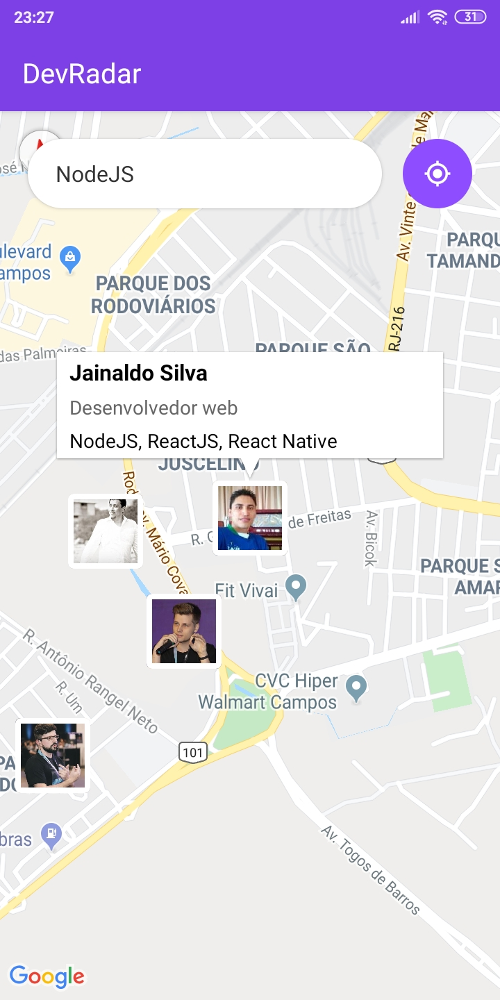
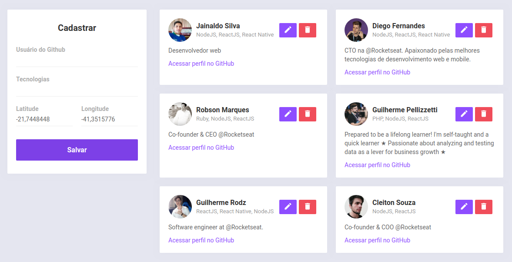

<h1 align="center">
🚀 Semana OmniStack 10 - DevRadar
</h1>

<p align="center"> 🚀 DevRadar: Aplicação desenvolvida na 10° semana da Ominstack feito pela Rocketseat.</p>

<p align="center">
  

  
  
  <a href="https://github.com/Rocketseat/semana-omnistack-10/commits/master">
    
  </a>

  <a href="https://github.com/Rocketseat/semana-omnistack-10/issues">
    
  </a>

  
</p>

<h1 align="center">
  </img>
  </img>
</h1>

<br>

## 🚀 Tecnologias

Esse projeto foi desenvolvido com as seguintes tecnologias:

- [Node.js](https://nodejs.org/en/)
- [React](https://reactjs.org)
- [React Native](https://facebook.github.io/react-native/)
- [Expo](https://expo.io/)

## 💻 Projeto

O DevRadar é um projeto que visa conectar desenvolvedores próximos a você que trabalham com as mesmas tecnologias.


## :gear: Instalação

### Backend - Api

 - Clonar o repositório para sua máquina: `git clone [link do repositório]`;
 - Acessar a pasta `backend` e renomear o arquivo `.env.example` para `.env`;
 - Abrir o arquivo `.env` e configurar a variável de ambiente do MongoDB com a string de conexão com seu `User:Senha`.

  ```javascript
    MONGO_URL=stringdeconexaodomongodb
  ``` 
 - Dentro da pasta `backend` instalar as dependências:
 ```bash
 cd backend
 yarn install
  ```
 - Para iniciar o **Servidor** utilize o comando:
```bash
yarn dev
```

### Web

- Acessar a pasta `web` e instalar as dependências:
```bash
cd web
yarn install
```
- Para iniciar a **Aplicação web** do React utilize o comando:
```bash
yarn start
```
- A aplicação web estará disponível em `http://localhost:3000`.


### Mobile

- Acessar a pasta `mobile`;
- Adicionar o IP do seu servidor (ou computador) no arquivo `src/services/api.js`;
- Instalar as dependências:
```bash
# NÃO é preciso executar a linha de baixo caso já tenha o Expo (CLI) instalado
yarn global add install expo-cli
cd mobile
yarn install
yarn start
```
Assim que o processo terminar, automaticamente será aberta no seu navegador a página `localhost:19002`. Conecte seu emulador, ou teste o aplicativo por `LAN`: baixe o aplicativo `Expo` da Play Store ou App Store e em seguida escaneie o código QR.

## :memo: Licença

Esse projeto está sob a licença MIT. Veja o arquivo [LICENSE](LICENSE.md) para mais detalhes.